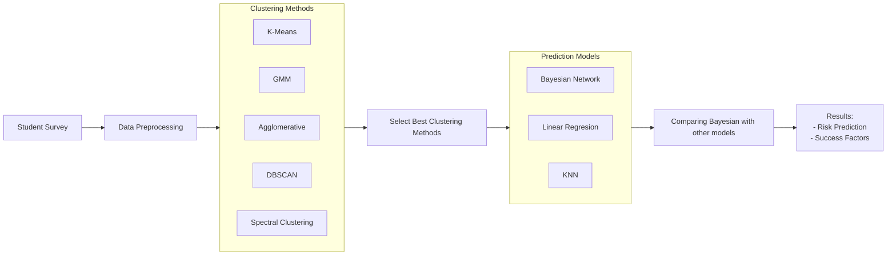

```mermaid
flowchart LR
    A[Student Survey] --> B[Data Preprocessing]
    B --> C[Clustering<br/>4 parallel methods]
    
    subgraph C [Clustering Methods]
        direction LR
        C1[K-Means]
        C2[GMM]
        C3[Agglomerative]
        C4[DBSCAN]
        C5[Spectral Clustering]
    end
    
    
    C --> G[Select Best Clustering Methods]

    
    G --> H[Bayesian Network]
    subgraph H [Prediction Models]
        direction LR
        H1[Bayesian Network]
        H2[Linear Regresion]
        H3[KNN]
    end
    H --> I[Comparing Bayesian with other models]
    I --> J[Results:<br/>- Risk Prediction<br/>- Success Factors]
```
